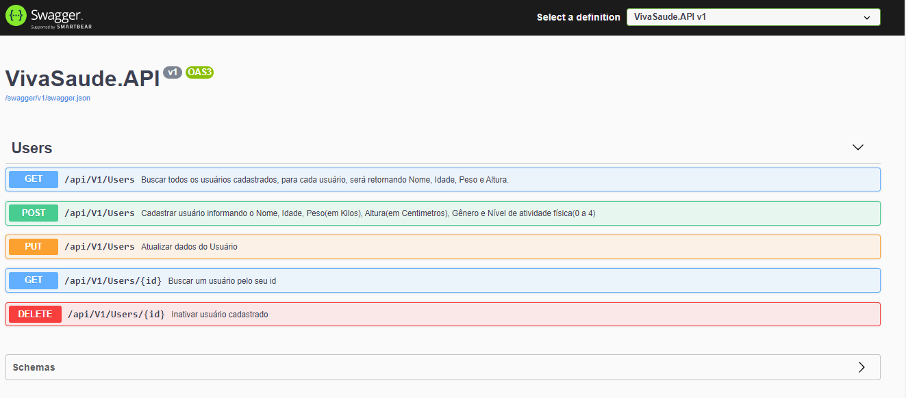

# VivaSaude_API
Essa Api tem como objetivo calcular o IMC (Índice de Massa Corpórea) e o TDEE(Gasto de calorias diária) do usuário.

O Usuário irá se cadastrar informando Nome, Idade, Peso, Altura, Gênero e Nível de atividade física.

Com esses dados a API irá retornar todos os dados que foram cadastrados, junto com o IMC, ImcStatus e TDEE.

Essas informações servirão como base, para um profissional da área de saúde montar uma dieta baseada nos resultados fornecidos pela API.

  

